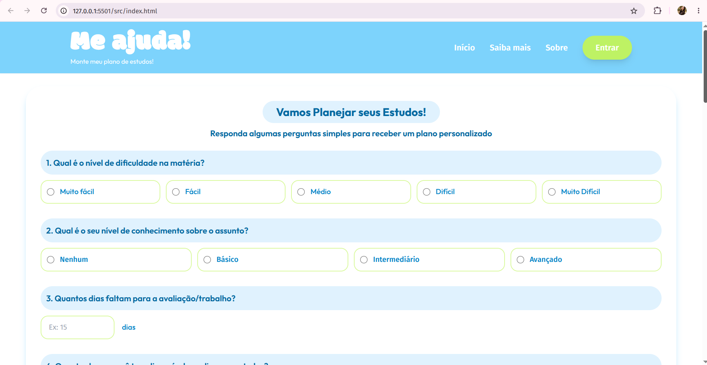
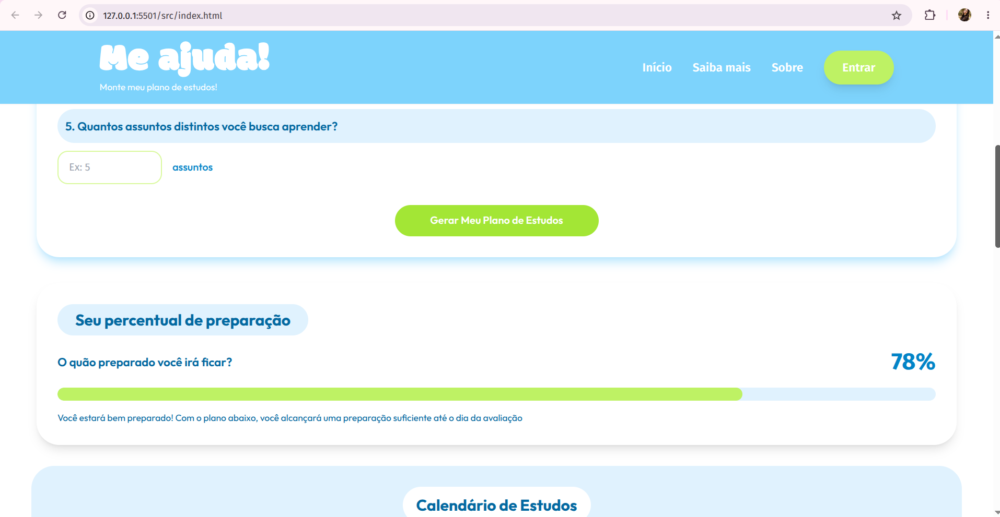
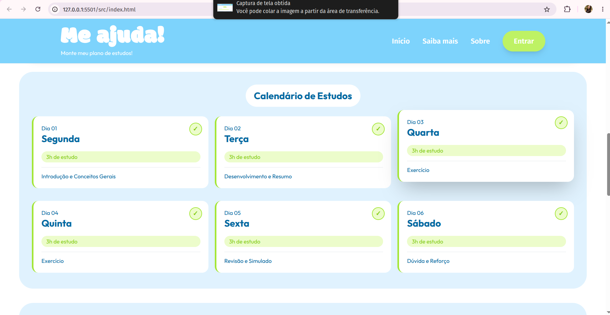
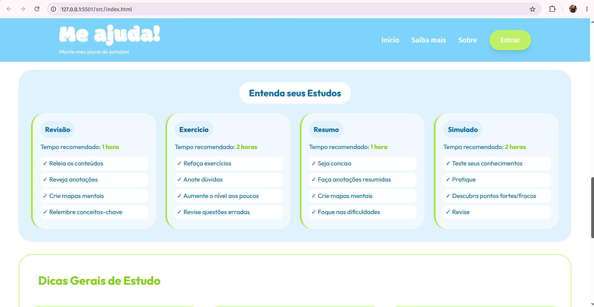
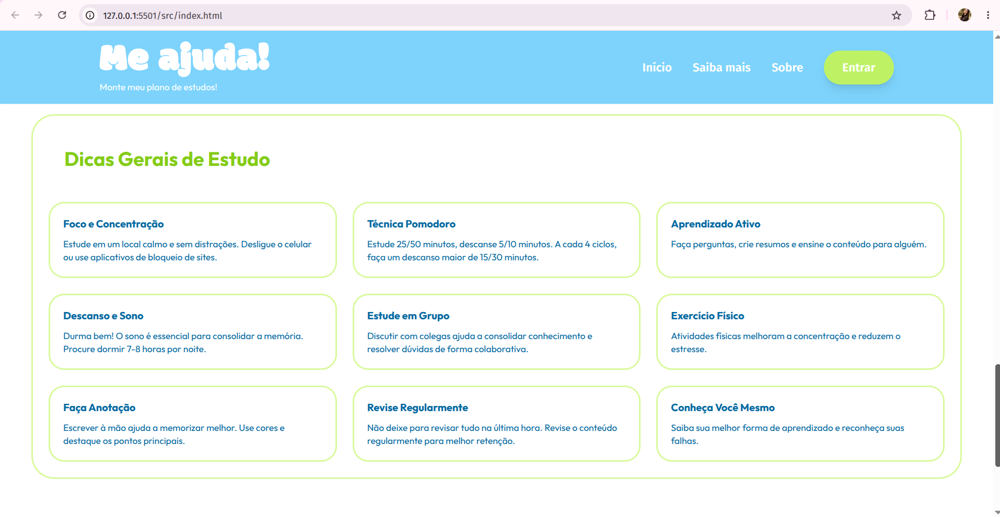
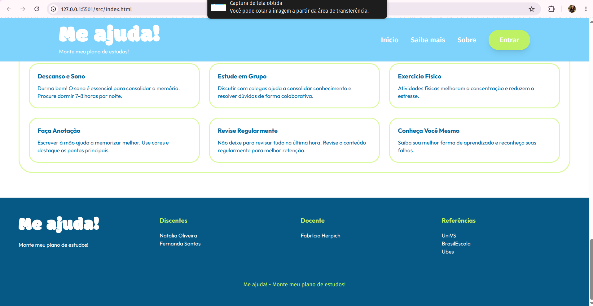

<h1 align='center'> 📚 meajuda!</h1>

O Meajuda é uma ferramenta web desenvolvida para auxiliar estudantes com dificuldades em organização e planejamento de estudos. É possivel criar um plano de estudos de forma rápida e prática, com apenas algumas perguntas. O objetivo do projeto é fornecer uma ajuda estruturada e confiável para estudantes melhorarem seu desempenho acadêmico através de só uma plataforma.

---

## ✨ Funcionalidades

- ✅ Nível de dificuldade da matéria.
- ✅ Avaliação do conhecimento prévio do estudante.
- ✅ Leva em cosideração a rotina de cada pessoa.
- ✅ Cálculo do percentual de preparação.
- ✅ Geração de calendário de estudos personalizado.
- ✅ Sugestões de revisão, exercícios, resumos e simulados.
- ✅ Dicas gerais para melhorar o aprendizado.

---

## 🛠️ Tecnologias Utilizadas

  
  
  
  

---

## 🎯 Objetivo Acadêmico

Este projeto foi desenvolvido como atividade acadêmica com o propósito de aplicar conceitos de desenvolvimento web, ODS ONU, interface responsiva e experiência do usuário, criando uma ferramenta capaz de auxiliar estudantes na organização de seus estudos.

---

## 📸 Demonstração do Projeto

<table>
<tr>
<td align="center">

</td>
<td align="center">

</td>
<td align="center">

</td>
</tr>

<tr>
<td align="center">
Tela Inicial
</td>
<td align="center">
Percentual de Preparação
</td>
<td align="center">
Calendário de Estudos
</td>
</tr>

<tr>
<td align="center">

</td>
<td align="center">

</td>
<td align="center">

</td>
</tr>

<tr>
<td align="center">
Métodos de Estudo
</td>
<td align="center">
Dicas Gerais
</td>
<td align="center">
Rodapé do Projeto
</td>
</tr>
</table>

---
<table align="center">
  <tr>
    <td width="800">

## 👩‍💻 Desenvolvedoras
- Natalia Oliveira e Fernanda Santos

</td>
    <td width="800">

## 👨‍🏫 Docente
- Fabrício Herpich

</td>
  </tr>
</table>

---

## 📄 Licença

Projeto desenvolvido para fins educacionais.
